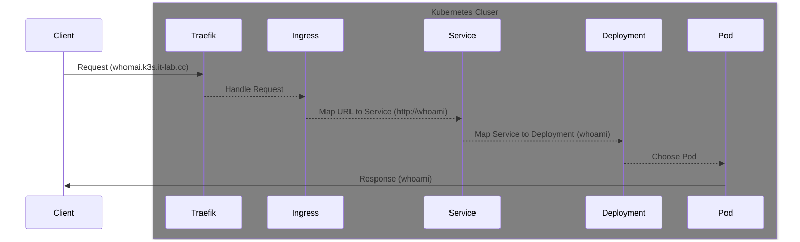

# Networking with Traefik

- Service to proxy deployment (via selector `io.kompose.service: proxy`)
- Middleware for auto redirection https in `default` namespace (`allowCrossNamespace: true` must be set).
- Ingress creates an Traefik Object, which is connected to the service. `web` and `websecure` as entrypoint and `middleware` for redirection.



Ingress Template

```bash
apiVersion: networking.k8s.io/v1
kind: Ingress
metadata:
  name:
  namespace:
  annotations:
    traefik.ingress.kubernetes.io/router.middlewares: default-cors@kubernetescrd,default-redirectscheme@kubernetescrd
spec:
  rules:
    - host: example.k3s.test
      http:
        paths:
          - path: /
            pathType: Prefix
            backend:
              service:
                name:
                port:
                  number:
```
