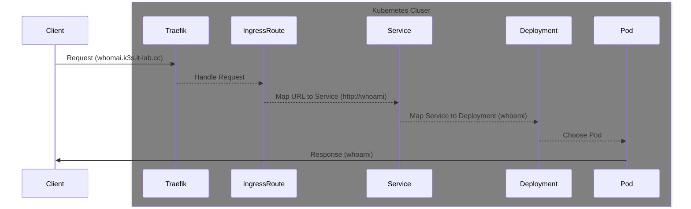

# Sequence Diagram for Whoami with Traefik and IngressRoute

```mermaid
sequenceDiagram
    participant Client
    box Grey Kubernetes Cluser
    participant Traefik
    participant IngressRoute
    participant Service
    participant Deployment
    participant Pod
    end
    Client->>Traefik: Request (whomai.k3s.it-lab.cc)
    Traefik-->>IngressRoute: Handle Request
    IngressRoute-->>Service: Map URL to Service (http://whoami)
    Service-->>Deployment: Map Service to Deployment (whoami)
    Deployment-->>Pod: Choose Pod
    Pod->>Client: Response (whoami)
```
